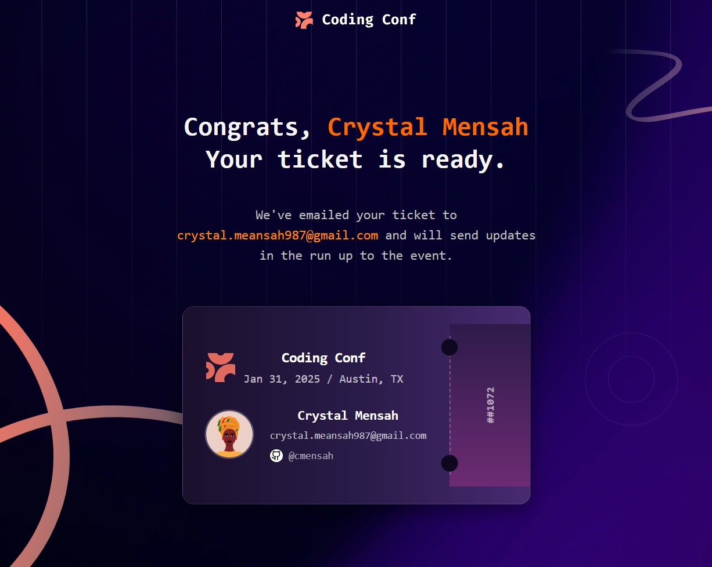

# Frontend Mentor - Conference ticket generator solution

This is a solution to the [Conference ticket generator challenge on Frontend Mentor](https://www.frontendmentor.io/challenges/conference-ticket-generator-oq5gFIU12w). Frontend Mentor challenges help you improve your coding skills by building realistic projects

## Overview

A simple React-based application that allows users to generate and preview digital event tickets.  
Built with **React**, **Tailwind CSS**, and **Context API** for global state management.

### The challenge

Users should be able to:

- Complete the form with their details
- Receive form validation messages if:
  - Any field is missed
  - The email address is not formatted correctly
  - The avatar upload is too big or the wrong image format
- Complete the form only using their keyboard
- Have inputs, form field hints, and error messages announced on their screen reader
- See the generated conference ticket when they successfully submit the form
- View the optimal layout for the interface depending on their device's screen size
- See hover and focus states for all interactive elements on the page

### Screenshot

### Links

- Solution URL: [Github URL](https://github.com/encrentsil/conference-ticket-generator/tree/main/Frontend)
- Live Site URL: [Netlify URL](https://ticket-generater.netlify.app/)

### Built With

- React
- Tailwind CSS
- Shadcn UI
- React Context API
- Vite
